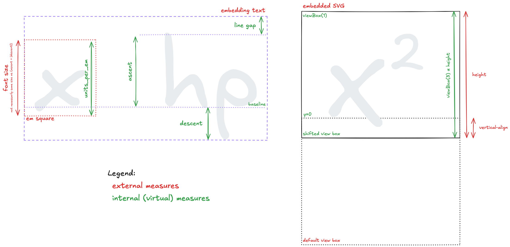

# Asciidoctor PDF MathJax


**Asciidoctor PDF MathJax** is an extension that enhances [Asciidoctor PDF](https://github.com/asciidoctor/asciidoctor-pdf) by integrating [MathJax](https://www.mathjax.org/) to render high-quality mathematical expressions in PDF documents.
This tool bridges the gap between Asciidoctor's native PDF generation and the need for beautifully typeset STEM (Science, Technology, Engineering, and Mathematics) content, leveraging MathJax's powerful rendering capabilities.

## Features

- **Seamless MathJax Integration**: Converts AsciiMath and LaTeX expressions into SVG or raster images compatible with Asciidoctor PDF.
- **Cross-Platform Support**: Works with Asciidoctor’s PDF backend to produce consistent output across platforms.
- **Customizable Rendering**: Adjust MathJax settings for font size, style, and output format.
- **Support for Inline and Block Equations**: Render both inline (`stem:[x^2]`) and block equations (`[stem] \n++++\n\sqrt{a^2 + b^2}\n++++`) effortlessly.

## Installation

### Prerequisites

- [Ruby](https://www.ruby-lang.org/) 2.7 or higher
- [Asciidoctor](https://asciidoctor.org/) ([installation instructions](https://docs.asciidoctor.org/asciidoctor/latest/install/))
- [Asciidoctor PDF](https://github.com/asciidoctor/asciidoctor-pdf) ([installation instructions](https://github.com/asciidoctor/asciidoctor-pdf?tab=readme-ov-file#prerequisites))
- [NodeJS](https://nodejs.org/en)
- [MathJax Node](https://github.com/mathjax/MathJax-node) (`npm install -g mathjax-node`)
- [NokoGiri](https://nokogiri.org/index) (`gem install nokogiri`)
- [TTFunk](https://github.com/prawnpdf/ttfunk) (`gem install ttfunk`)

When working with AsciiMath, you also need to install

- [AsciiDoctor AsciiMath](https://github.com/asciidoctor/asciimath)(`gem install asciimath`)

A good starting point is using the [Asciidoctor Docker Container](https://github.com/asciidoctor/docker-asciidoctor), which comes with most dependencies pre-installed.
You can find an example on how to use the docker container in [this Dockerfile](test/Dockerfile).

## Usage

1. Enable the extension in your AsciiDoc document by adding the following attribute to the header:
   ```asciidoc
   :stem:
   ```
2. Write your mathematical expressions using AsciiMath or LaTeX syntax:
   ```asciidoc
   Inline example: stem:[e^{i\pi} + 1 = 0]

   Block example:
   [stem]
   ++++
   \frac{1}{1 + \frac{1}{x}}
   ++++
   ```

## Issues
Found a bug or have a suggestion? Please open an issue on the [GitHub Issues page](https://github.com/Crown0815/asciidoctor-pdf-mathjax/issues).

## How the alignment works



## Acknowledgements

- [Asciidoctor](https://asciidoctor.org/) for the powerful document conversion framework.
- [MathJax](https://www.mathjax.org/) for its exceptional math rendering engine.
- The open-source community for continuous inspiration and support.
