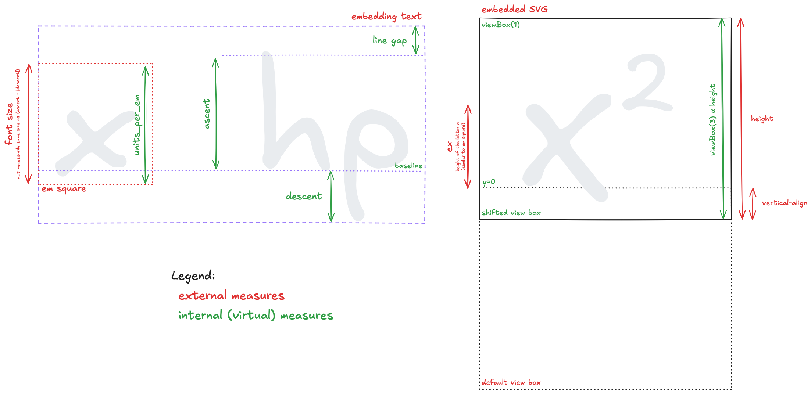

# Asciidoctor PDF MathJax


An extension for [Asciidoctor PDF](https://github.com/asciidoctor/asciidoctor-pdf) that
integrates [MathJax](https://www.mathjax.org/) to render mathematical expressions in PDF output.

This Ruby gem enhances the [asciidoctor-pdf](https://github.com/asciidoctor/asciidoctor-pdf) converter by enabling
high-quality rendering of STEM (Science, Technology, Engineering, and Math) content
using [MathJax](https://www.mathjax.org/).
It processes AsciiDoc documents with mathematical notation (e.g., AsciiMath or LaTeX) and outputs them as beautifully
formatted equations in the resulting PDF.

## Features

- **Seamless MathJax Integration**: Converts AsciiMath and LaTeX expressions into SVG or raster images compatible with Asciidoctor PDF.
- **Cross-Platform Support**: Works with Asciidoctor’s PDF backend to produce consistent output across platforms.
- **Support for Inline and Block Equations**: Render both [inline](https://docs.asciidoctor.org/asciidoc/latest/stem/#inline) and [block](https://docs.asciidoctor.org/asciidoc/latest/stem/#block) STEM content effortlessly.
- **High Quality STEM Rendering**: Utilizes MathJax’s powerful rendering engine to produce high-quality STEM content in
  PDF output.

## Installation

### Prerequisites

- [Ruby](https://www.ruby-lang.org/) 2.7 or higher
- [Asciidoctor](https://asciidoctor.org/) and [Asciidoctor PDF](https://github.com/asciidoctor/asciidoctor-pdf) ([installation instructions](https://github.com/asciidoctor/asciidoctor-pdf?tab=readme-ov-file#prerequisites))
- [NodeJS](https://nodejs.org/en)
- [MathJax Node](https://github.com/mathjax/MathJax-node) (required for PDF generation with LaTeX).
  Install it globally with
  ```sh
  npm install -g mathjax-node
  ```

A good starting point is using the [Asciidoctor Docker Container](https://github.com/asciidoctor/docker-asciidoctor), which comes with most dependencies pre-installed.
You can find an example of a docker container configuration for Asciidoctor PDF MathJax in [this Dockerfile](test/Dockerfile).

### Installation from RubyGems

1. The `asciidoctor-pdf-mathjax` gem is available on RubyGems at https://rubygems.org/gems/asciidoctor-pdf-mathjax.
   To install it:
   ```shell
   ruby -v
   ```

   If Ruby isn’t installed, visit ruby-lang.org for installation instructions.
2. Install the `asciidoctor-pdf-mathjax` gem:
   ```shell
   gem install asciidoctor-pdf-mathjax
   ```
   This command fetches and installs the latest version of asciidoctor-pdf-mathjax along with its dependencies.
3. Verify the installation by running:
   ```shell
   gem list asciidoctor-pdf-mathjax
   ```
   You should see asciidoctor-pdf-mathjax listed with its installed version.

## Usage

To use asciidoctor-pdf-mathjax, you need to require it as an extension when running asciidoctor-pdf and ensure your
AsciiDoc document specifies the `:stem:` attribute.

### Example Asciidoctor PDF Call

Here’s how to convert an AsciiDoc file with mathematical content to PDF using this gem:

1. Create an AsciiDoc file (e.g., `mathdoc.adoc`) with STEM content:
   ```asciidoc
   = Document with Math
   :stem:

   This document includes an equation: stem:[E = mc^2].

   [stem]
   ++++
   \int_0^\infty e^{-x} \, dx = 1
   ++++
   ```

2. Run the `asciidoctor-pdf` command with the extension:
   ```shell
   asciidoctor-pdf -r asciidoctor-pdf-mathjax mathdoc.adoc -o mathdoc.pdf
   ```
   - `-r asciidoctor-pdf-mathjax`: Loads the extension.
   - `mathdoc.adoc`: The input AsciiDoc file.
   - `-o mathdoc.pdf`: The output PDF file.

3. Check the output: Open `mathdoc.pdf` to see the rendered equations (e.g., $E=mc^2$ and the integral) in high-quality
   typesetting.

#### Notes

- The `:stem:` attribute must be set in the document header or via the `-a stem` flag to enable STEM processing.
- Both inline (`stem:[...]` or `latexmath:[...]`) and block (`[stem]`) STEM content are supported.
- Ensure your system has internet access during the first run, as MathJax may need to fetch resources (subsequent runs
  can work offline if cached).

## Issues
Found a bug or have a suggestion? Please open an issue on the [GitHub Issues page](https://github.com/Crown0815/asciidoctor-pdf-mathjax/issues).

### Known Issues

- High inline math expressions may be cropped at the bottom due to the alignment logic.
  To avoid this, consider using block math expressions.
- For very high inline math expressions, asciidoctor-pdf will align them to the bottom of the text, which is undesired.
  To avoid this, consider using block math expressions,
  or [raise an issue in asciiidoctor-pdf](https://github.com/asciidoctor/asciidoctor-pdf/issues).

## Equation alignment background



## License

This project is licensed under the MIT License. See the [LICENSE](LICENSE) file for details.

## Acknowledgements

- [Asciidoctor](https://asciidoctor.org/) and [Asciidoctor PDF](https://github.com/asciidoctor/asciidoctor-pdf) for the
  powerful document conversion framework.
- [MathJax](https://www.mathjax.org/) for its exceptional math rendering engine.
- The open-source community for continuous inspiration and support.
